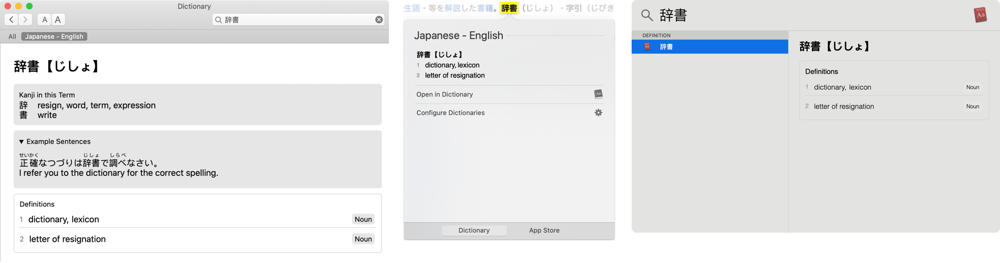
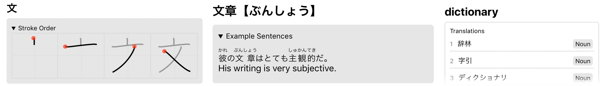

# Japanese-English Dictionary

## Features
> Clean UI that adapts to context
  

### Features Aimed at Japanese Learners
> 
  Stroke order, example sentences and English -> Japanese lookup.

Note: English -> Japanese lookup is a work in progress and may not be entirely reliable or accurate.

## Data Sources
The dictionary is based on JMDict, KanjiDic2, Tatoeba example sentences, KanjiVG stroke order diagrams. All licensing information can be found below.

## Compiling
Compiling requires ~6GB of free ram.
To compile the dictionary there are a number of requirements:
 - Apple dictionary development kit
 - Python 3.7+ with pip requirements:
    - jinja2
    - mecab-python3
    - jaconv
 - XZip
 - XMLLint
 - MeCab

To compile run
> $./compile.sh

or to compile a sample dictionary containing a small subset of words
> $./compile_sample.sh

useful for testing as the full version can take up to an hour to compile

## Copyright and Usage Information
### EDICT and KanjiDic
This package uses the [EDICT](http://www.csse.monash.edu.au/~jwb/edict.html) and [KANJIDIC](http://www.csse.monash.edu.au/~jwb/kanjidic.html) dictionary files. These files are the property of the [Electronic Dictionary Research and Development Group](http://www.edrdg.org/), and are used in conformance with the Group's [licence](http://www.edrdg.org/edrdg/licence.html).

### Tatoeba
The example sentences in this dictionary are provided by [Tatoeba.org](https://tatoeba.org/eng/downloads) under the [Creative Common Attribution 2.0 France](https://creativecommons.org/licenses/by/2.0/fr/) (CC BY 2.0 FR) license.

### KanjiVG
The kanji samples in this dictionary are provided by [KanjiVG](https://kanjivg.tagaini.net/) under the [Creative Common Attribution-ShareAlike 3.0 Unported](https://creativecommons.org/licenses/by-sa/3.0/) (CC BY-SA 3.0) license and are copyright © 2009-2018 Ulrich Apel.

### Wiktionary
The english entries in this dictionary are filtered using text data from Wiktionary, which is released under the [GNU Free Documentation License (GFDL)](https://www.wikipedia.org/wiki/Wikipedia:Copyrights) and the  [Creative Commons Attribution-Share-Alike 3.0](https://creativecommons.org/licenses/by-sa/3.0/) License.